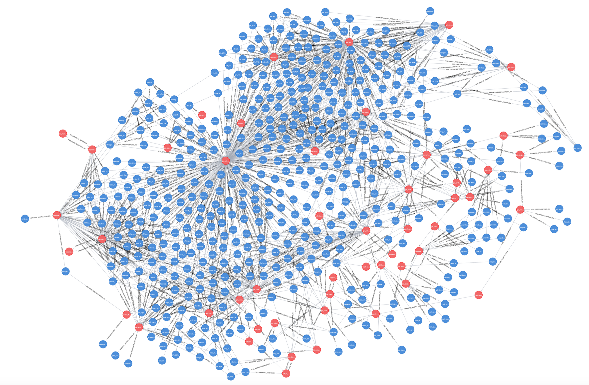
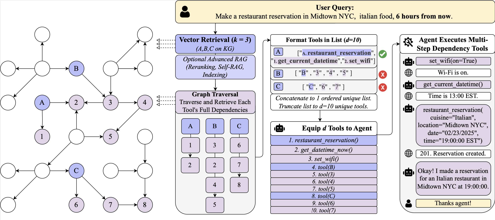
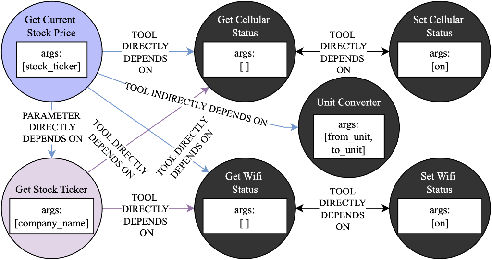
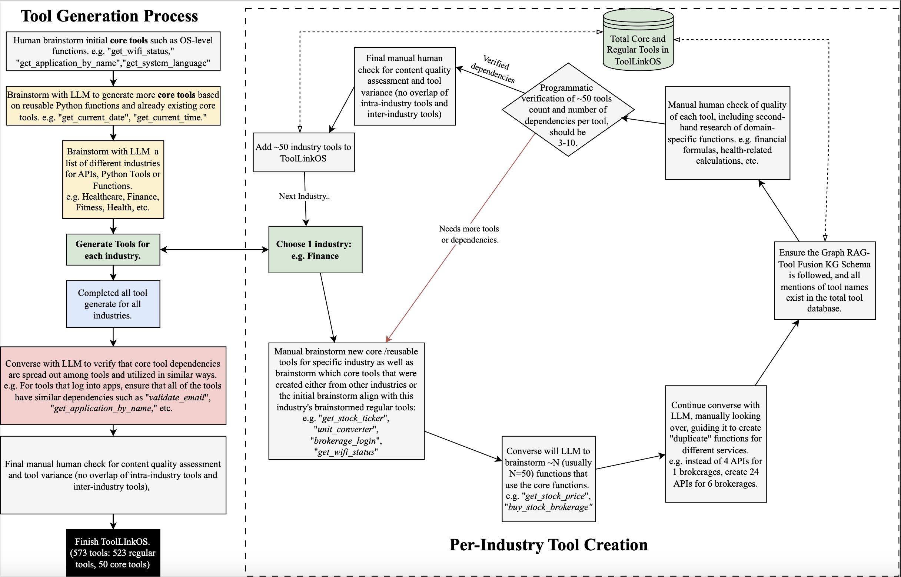

# **Graph RAG-Tool Fusion**

This repository accompanies the research paper [Placeholder Link]. In the paper, we introduce Graph RAG-Tool Fusion (advanced tool retrieval approach) and the **ToolLinkOS dataset**, a collection of **573 fictional tools** with an average of **6.3 dependencies each**, spanning over **15 industries**.

---

Recent developments in retrieval-augmented generation (RAG) for selecting relevant tools from a tool knowledge base enable LLM agents to scale their complex tool calling capabilities to hundreds or thousands of external tools, APIs, or agents-as-tools. However, traditional RAG-based tool retrieval fails to capture structured dependencies between tools, limiting the retrieval accuracy of a retrieved tool’s dependencies. For example, among a vector database of tools, a "get stock price" API requires a "stock ticker" parameter from a "get stock ticker" API, and both depend on OS-level internet connectivity tools. In this paper, we address this limitation by introducing **Graph RAG-Tool Fusion**, a novel plug-and-play approach that combines the strengths of vector-based retrieval with efficient graph traversal to capture all relevant tools (nodes) along with any nested dependencies (edges) within the predefined tool knowledge graph. We also present **ToolLinkOS**, a new tool selection benchmark of **573 fictional tools**, spanning over **15 industries**, each with an average of **6.3 tool dependencies**. We demonstrate that **Graph RAG-Tool Fusion** achieves absolute improvements of **71.7% and 22.1%** over naive RAG on **ToolLinkOS** and **ToolSandbox** benchmarks, respectively (**mAP@10**).

## **Graph Representation of Tool Dependencies**

Below is a visual representation of how tools are interconnected in ToolLinkOS, demonstrating the hierarchical dependencies between tools, APIs, and core functions.



This structure enables **Graph RAG-Tool Fusion** to retrieve tools more effectively compared to traditional RAG methods.

---

## **The Graph RAG-Tool Fusion Approach**

The figure below illustrates a user query for making a restaurant reservation in **Midtown NYC**. The **Graph RAG-Tool Fusion** model retrieves all required tools, their dependencies, and executes them step-by-step to fulfill the request.



## **GraphRAG-Tool Fusion Knowledge Graph Schema (ToolLinkOS Example)**
The KG schema within ToolLinkOS is as follows:
- Node Types:
  - Core Tool: A reusable function that is a typical dependency of other tools. These tools provide essential functionalities, such as “get_current_date”, which other tools may require before execution.
  - Regular Tool: A tool, API, or agent-as-tool that performs a specific function. These tools may have dependencies on core or other regular tools. For example, “get_stock_price” depends on “get_stock_ticker”.
- Edge Types:
  - Tool Directly Depends On: A tool requires another tool to operate. For example, “set_wifi_on” must be executed before a tool requiring internet connectivity.
  - Tool Indirectly Depends On: A tool benefits from another but does not strictly require it. For example, a “restaurant_reservation” tool may use “get_weather”, but it can still function without it.
  - Parameter Directly Depends On: A required parameter must be obtained from another tool before execution. For instance, “product_info” needs a “product_id” from “get_product_id”.
  - Parameter Indirectly Depends On: A parameter depends on additional context only if required by the user. For example, “tomorrow” requires “get_current_date” but a fixed date does not.

Example of the schema for a few tools during retrieval:


---

## **Dataset Overview**

| Feature                   | ToolLinkOS | ToolSandbox | ToolBench | ToolE | Seal-Tools | ComplexFuncBench |
|---------------------------|------------|------------|------------|------|------------|------------------|
| **Number of Tools**       | **573**    | 34         | 16,464     | 199  | 4,076      | 48               |
| **Number of Instances**   | 1,569      | 1,032      | 126,486    | 21,127| 14,076     | 1,000            |
| **Tool Dependencies**     | ✓          | ✓          | ✗          | ✗    | ✗          | ✗                |
| **KG Schema**            | ✓          | ✗          | ✗          | ✗    | ✗          | ✗                |
| **Avg. Dependencies/Tool**| **6.3**    | 1.6        | N/A        | N/A  | N/A        | N/A              |
| **Real API Response**     | ✗          | ✓          | ✗          | ✗    | ✗          | ✗                |

---

## **Tool Generation Process**

ToolLinkOS was constructed through an iterative process involving **LLM-based brainstorming, dependency verification, and manual validation** to ensure high-quality tool relationships across industries.



---

## **Disclaimer**
All references to company names or services in the ToolLinkOS dataset are entirely fictional and used solely for illustrative purposes. No endorsement or affiliation is implied. The tools are non-functional and are only for research and illustrative purposes. There is no intended goal to make the tools functional. 

---

## **Citation**
If you use this dataset or method, please cite our work:
```
@article{GraphRAG-ToolFusion,
  title={Graph RAG-Tool Fusion: Enhancing Retrieval-Augmented Tool Use with Graph Knowledge},
  author={[Author Names]},
  year={2024},
  journal={[Conference/Journal Name]},
  url={Placeholder Link}
}
```

